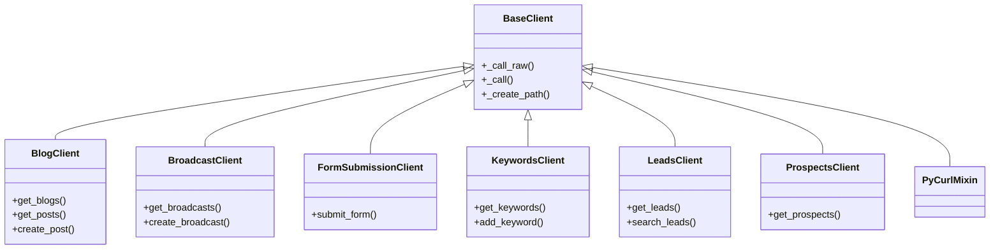

## hapipy

### Overview

**hapipy** (v2.10.6) is a Python wrapper around [HubSpot's REST APIs](https://docs.hubapi.com), providing a unified client interface for interacting with the Blog, Broadcast, Forms, Keywords, Leads, and Prospects API endpoints. All domain-specific clients inherit from a shared `BaseClient` HTTP engine that handles authentication injection, request retry with exponential backoff, gzip decompression, and structured error mapping — so each client module only needs to define its API-specific paths, parameters, and payload formats.

Docs for this wrapper can be found [here](https://github.com/HubSpot/hapipy/wiki/hapipy-documentation).

General API reference documentation can be found [here](https://docs.hubapi.com).

### Module Listing

The `hapi/` package contains the following modules:

| Module | Description |
|--------|-------------|
| `hapi/base.py` | Core HTTP engine (`BaseClient`) with retry logic, authentication strategy selection, and gzip handling. All domain clients inherit from this class. |
| `hapi/blog.py` | `BlogClient` for the HubSpot Blog/Content API v2 — manages blogs, blog posts, comments, and topics. |
| `hapi/broadcast.py` | `BroadcastClient` for the Social Broadcast API v1, plus `BaseSocialObject`, `Broadcast`, and `Channel` value-object models. |
| `hapi/error.py` | Error hierarchy including `HapiError`, `EmptyResult`, and HTTP-status-specific subclasses (`HapiBadRequest`, `HapiNotFound`, `HapiTimeout`, `HapiUnauthorized`, `HapiServerError`). |
| `hapi/forms.py` | `FormSubmissionClient` for HubSpot form submissions via the `forms.hubspot.com` endpoint with URL-encoded payloads. |
| `hapi/keywords.py` | `KeywordsClient` for the Keywords API v1 — single and batch keyword CRUD operations. |
| `hapi/leads.py` | `LeadsClient` for the Lead Management API v2 — lead retrieval, search, registration, updates, and close/open workflows. |
| `hapi/prospects.py` | `ProspectsClient` for the Prospects API v1 — timeline-based prospect retrieval with geographic and company filters. |
| `hapi/utils.py` | Authentication utilities including the `auth_checker` decorator, `refresh_access_token` for OAuth token management, and `NullHandler`/`get_log` logging helpers. |
| `hapi/logging_helper.py` | HTTP request tracing and logging configuration via `call_with_tracing` and `PrettyRequestsHTTPPrinter`. |
| `hapi/mixins/threading.py` | `PyCurlMixin` for parallel HTTP execution using pycurl, with queue-and-batch request processing. |

### Class Hierarchy

All domain clients inherit from `BaseClient`, which provides the shared HTTP lifecycle (authentication, retries, response parsing, and error mapping). The inheritance tree is as follows:

```
BaseClient
├── BlogClient
├── BroadcastClient
├── FormSubmissionClient
├── KeywordsClient
├── LeadsClient
├── ProspectsClient
└── PyCurlMixin (threading mixin)
```



Each domain client overrides `API_PATH` and `API_VERSION` class attributes to define its endpoint namespace, then delegates all HTTP execution to `BaseClient._call_raw()`.

### Authentication Modes

hapipy supports three authentication modes for accessing HubSpot APIs:

1. **API Key (`api_key`)** — The HubSpot API key is injected as a `hapikey` query parameter on every request. This is the simplest authentication method for server-to-server integrations.

2. **OAuth Access Token (`access_token`)** — A valid OAuth 2.0 access token is passed via the `Authorization: Bearer` header. Suitable for short-lived sessions where the token is already available.

3. **OAuth Refresh Token (`refresh_token`)** — When providing a `refresh_token` along with `client_id` and optionally `client_secret`, the client can automatically refresh expired access tokens by calling HubSpot's `/auth/v1/refresh` endpoint.

For detailed authentication setup instructions, credential configuration, and example usage, see [`docs/intro.md`](docs/intro.md).

### Quick Start

Install hapipy via pip:

```bash
pip install hapipy
```

Instantiate a domain client with your API key:

```python
from hapi.leads import LeadsClient
from hapi.blog import BlogClient

# Using an API key
leads_client = LeadsClient(api_key='your-api-key-here')
leads = leads_client.get_leads()

# Using an OAuth access token
blog_client = BlogClient(access_token='your-access-token-here')
blogs = blog_client.get_blogs()

# Using an OAuth refresh token for automatic token management
from hapi.keywords import KeywordsClient
keywords_client = KeywordsClient(
    refresh_token='your-refresh-token',
    client_id='your-client-id',
    client_secret='your-client-secret'
)
keywords = keywords_client.get_keywords()
```

For threading and parallel execution, pass the `PyCurlMixin` as a mixin at instantiation time. See [`docs/intro.md`](docs/intro.md) for detailed threading guidance and the `hapi/mixins/threading.py` module docstring for the queue-and-batch execution model.

### Documentation Philosophy

This project follows a **Developer's Log** approach to documentation. Rather than maintaining a separate documentation site, comprehensive documentation is embedded directly within every source file as:

- **PEP 257-compliant docstrings** on every module, class, method, and function — covering purpose, parameters (`Args:`), return values (`Returns:`), exceptions (`Raises:`), and endpoint access patterns for API wrapper methods.
- **Rationale-driven inline comments** explaining the "why" behind non-trivial implementation decisions, using mandatory rationale categories (see below).

Every API client method documents its **endpoint access pattern**: the HTTP method used, the full URL pattern, how authentication is injected, the request body format, and the expected response structure. This ensures that developers can understand how each Python method translates to an underlying HubSpot REST API call without needing to read the base client internals.

### In-Code Documentation Guide for Contributors

All contributions must adhere to the following documentation standards:

#### Docstring Requirements

Every function, class, and method must include a complete docstring following PEP 257 conventions and the [Google Python Style Guide](https://google.github.io/styleguide/pyguide.html#38-comments-and-docstrings) section format:

```python
def method_name(self, param1, param2):
    """Perform action described as a command.

    Extended description providing context about
    how this method fits into the client lifecycle.

    Args:
        param1 (str): Description of param1.
        param2 (dict): Description of param2.

    Returns:
        dict: Parsed JSON response from the API.

    Raises:
        HapiError: When the API returns a non-2xx status code.
    """
```

- **Summary line**: A command phrase ending with a period (e.g., "Return all blogs." not "Returns all blogs.").
- **Args section**: Every parameter listed with `(type): description` on its own line.
- **Returns section**: Return type and description.
- **Raises section**: Exception types and the conditions that trigger them.
- **Endpoint Access block** (for API wrapper methods): HTTP method, URL pattern, authentication, body format, and response structure.

#### Inline "Why" Comment Requirements

Non-trivial implementation decisions must include inline comments explaining the developer's reasoning. Comments must never merely restate what the code does — they must explain **why** the approach was chosen. Each comment uses the following format:

```
# Why: [Category] — Specific rationale explaining the decision.
```

The mandatory rationale categories are:

- **Alternatives Considered** — State rejected approaches and why the chosen implementation was preferred.
- **Trade-offs** — Identify accepted compromises between competing concerns (complexity, coverage, performance, readability).
- **Assumptions Made** — Declare dependencies on external contracts, data formats, API behavior, or service expectations.
- **Refactoring Rationale** — When replacing existing patterns, specify the deficiency of the old approach and how the new implementation addresses it.
- **Future-proofing** — Note structural decisions made for anticipated changes or extensibility.

#### Forbidden Documentation Patterns

- Writing comments that merely restate code behavior (e.g., `# increment counter` above `counter += 1`).
- Adding docstrings without documenting parameters, return values, or purpose.
- Omitting rationale for non-obvious implementation choices when multiple approaches exist.
- Using vague rationales without specific justification.

### License

This project is licensed under the MIT License. See [LICENSE.txt](LICENSE.txt) for details.
