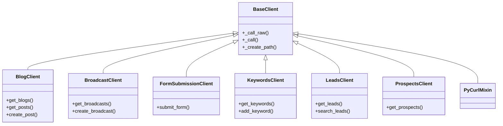
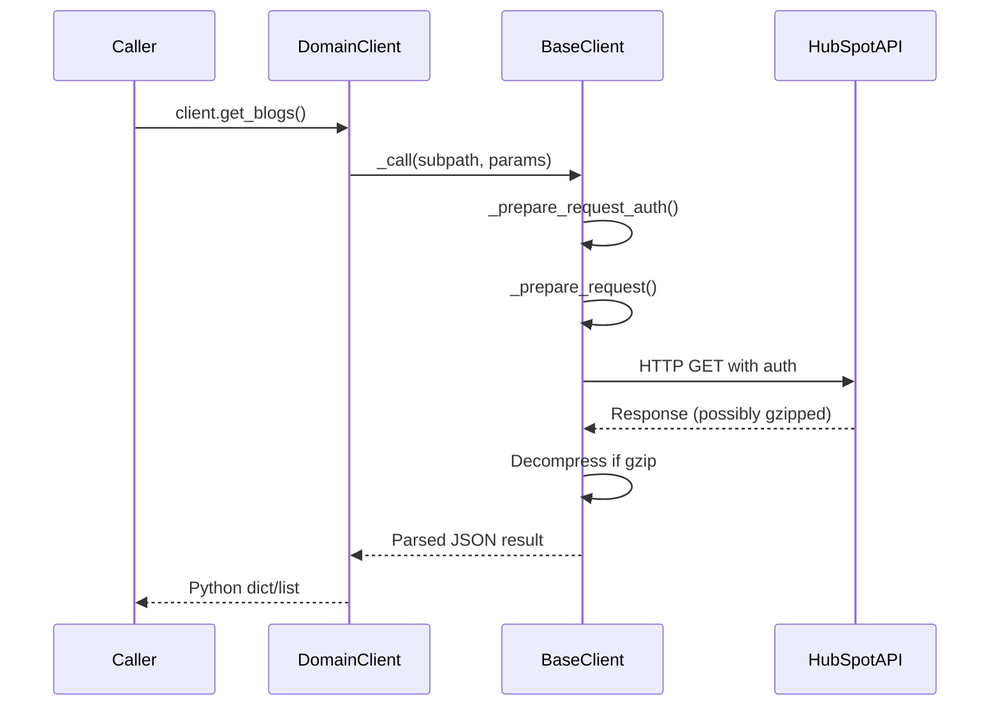
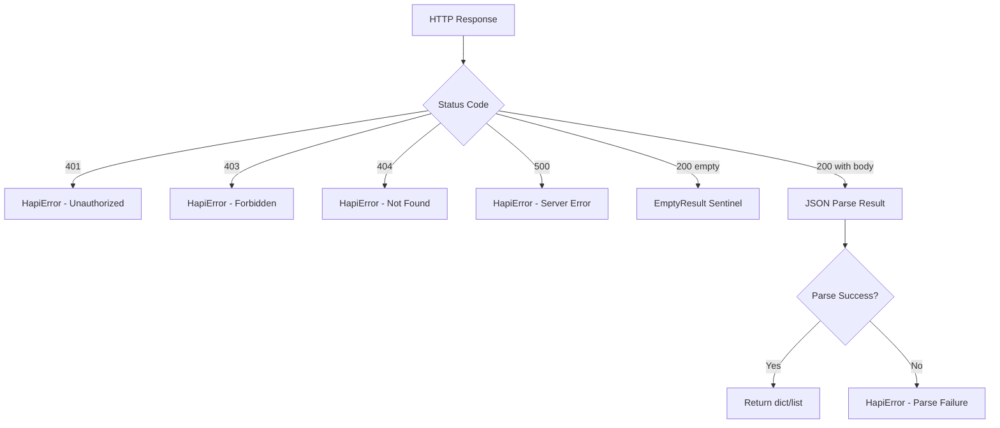

# Technical Specification

# 0. Agent Action Plan

## 0.1 Intent Clarification

### 0.1.1 Core Documentation Objective

Based on the provided requirements, the Blitzy platform understands that the documentation objective is to **retrofit comprehensive, developer-focused documentation into every code file in the hapipy repository** — a Python wrapper around HubSpot's REST APIs (version 2.10.6). The documentation will take the form of a "Developer's Log" woven directly into the codebase through PEP 257-compliant docstrings and rationale-driven inline comments.

- **Category:** Improve documentation coverage / Fix documentation gaps
- **Documentation Type:** In-code documentation (docstrings, inline comments), API endpoint access documentation, README improvements
- **Primary Deliverable:** Every function, class, method, and test fixture across all 21 source files in the `hapi/` package receives complete "what" documentation (docstrings with purpose, parameters, return values, exceptions) and "why" documentation (inline comments explaining design decisions using mandatory rationale categories)

**Documentation Requirements — Restated with Enhanced Clarity:**

- **DR-1 (Docstrings — Universal Coverage):** All new or modified functions, classes, and test fixtures must include docstrings — no exceptions. This applies to all 6 domain client modules, the `BaseClient` core, the error hierarchy, utility modules, mixin modules, and all 5 test suites.
- **DR-2 (Docstring Content — Structured Fields):** Each docstring must specify Purpose (clear description of what the function/class does), Parameters (name, type, description for each parameter), Return values (type and description), and Exceptions (any exceptions that may be raised).
- **DR-3 (Docstring Format — PEP 257):** Follow Python's standard docstring format per PEP 257 — triple double quotes (`"""`), summary line terminated by a period, blank line before elaboration, arguments listed each on a separate line.
- **DR-4 (Inline Comments — Why-Focused):** Comments must explain developer reasoning and decision-making, NOT describe what the code does. Position comments immediately adjacent to the code they reference.
- **DR-5 (Mandatory Why Categories):** Every significant implementation decision must document at least one rationale from: Alternatives Considered, Refactoring Rationale, Assumptions Made, Trade-offs, Future-proofing.
- **DR-6 (Endpoint Access Documentation):** Explain HOW each HubSpot API endpoint is accessed through the wrapper — covering URL construction, HTTP methods, authentication injection, and data serialization for every client method.
- **DR-7 (Forbidden Patterns):** Never restate code behavior in comments, never omit parameter/return documentation from docstrings, never leave non-obvious implementation choices undocumented.
- **DR-8 (Validation Gate):** Every function lacking a complete docstring or any non-trivial implementation decision lacking rationale documentation fails review automatically.

**Implicit Documentation Needs Surfaced:**

- The `hapi/__init__.py`, `hapi/mixins/__init__.py`, and `hapi/test/__init__.py` package files are currently empty and require module-level docstrings to document their namespace purpose
- The `BaseClient` dynamic mixin injection mechanism (modifying `__class__.__bases__` at runtime) is a non-obvious architectural decision requiring extensive "why" documentation
- The retry logic with exponential backoff in `_call_raw()` contains multiple design trade-offs (emergency brake at 10, max 6 retries, no POST retry by default) that must be documented
- The `LeadsClient.retrieve_lead()` blanket `try/except` that returns `{'guid': '-1'}` as a silent fallback is a deliberate fault-tolerance trade-off requiring explicit rationale
- The `FormSubmissionClient` deviates from all other clients by overriding `api_base` and using URL-encoded payloads — this architectural exception requires "Alternatives Considered" documentation
- The `BlogClient.get_pulished_posts()` misspelled method is kept for backward compatibility — this must be documented as a "Trade-offs" rationale

### 0.1.2 Special Instructions and Constraints

**Critical Directives Captured:**

- All documentation must be embedded directly within source code files as docstrings and inline comments — this is NOT a task to create standalone documentation files
- The "Developer's Log" metaphor means documentation should read as a narrative of the developer's thought process: what was built, why it was built that way, what was considered and rejected
- The validation gate is strict: any function without a complete docstring or any non-trivial decision without rationale documentation fails review automatically

**Style Preferences:**

- Tone: Technical, precise, developer-oriented
- Structure: PEP 257-compliant multi-line docstrings with `Args:`, `Returns:`, `Raises:` sections
- Depth: Comprehensive — every public method, every protected method, every test method, every class, every module
- Format: Python triple-double-quote docstrings (`"""`) with inline `#` comments for rationale

**Forbidden Patterns (User-Specified):**

- User Example: "Writing comments that merely restate code behavior" — e.g., `# increment counter` above `counter += 1`
- User Example: "Adding docstrings without documenting parameters, return values, or purpose"
- User Example: "Omitting rationale for non-obvious implementation choices when multiple approaches exist"
- User Example: "Documenting only what code does without explaining why that approach was chosen"
- User Example: "Leaving implementation decisions undocumented when there are valid alternatives"
- User Example: "Using vague rationales without specific justification"

### 0.1.3 Technical Interpretation

These documentation requirements translate to the following technical documentation strategy:

- To **document the BaseClient core engine**, we will **update** `hapi/base.py` by adding comprehensive class-level and method-level docstrings to `BaseClient` and all 14 of its methods, plus inline "why" comments explaining the retry logic design, mixin injection mechanism, authentication strategy, and gzip handling approach
- To **document all 6 domain client modules**, we will **update** `hapi/blog.py`, `hapi/broadcast.py`, `hapi/forms.py`, `hapi/keywords.py`, `hapi/leads.py`, and `hapi/prospects.py` by adding docstrings to every class and public method, with endpoint access documentation explaining the URL pattern, HTTP method, and payload format for each wrapper method
- To **document the error hierarchy**, we will **update** `hapi/error.py` by enriching existing docstrings with parameter/return documentation and adding rationale for the error class taxonomy design
- To **document utility modules**, we will **update** `hapi/utils.py` and `hapi/logging_helper.py` with function-level docstrings and rationale comments explaining the dual-module logging pattern
- To **document the parallel execution mixin**, we will **update** `hapi/mixins/threading.py` by adding method-level docstrings to `PyCurlMixin` and `HapiThreadedError` and inline rationale for the queue-and-batch execution model
- To **document all test suites**, we will **update** all 5 test modules (`test_base.py`, `test_broadcast.py`, `test_error.py`, `test_keywords.py`, `test_leads.py`) plus `helper.py` and `logger.py` by adding docstrings to every test class, test method, setUp/tearDown fixture, and helper function
- To **document package entry points**, we will **update** `hapi/__init__.py`, `hapi/mixins/__init__.py`, and `hapi/test/__init__.py` by adding module-level docstrings
- To **update project-level documentation**, we will **update** `README.md` to provide a more comprehensive overview reflecting the new documentation philosophy, and `setup.py` to include a module-level docstring

### 0.1.4 Inferred Documentation Needs

Based on code analysis:

- `hapi/base.py` contains 14 methods on `BaseClient` — only the class itself has a one-line docstring; all methods are undocumented
- `hapi/blog.py` contains 12 public methods on `BlogClient` — zero have docstrings; the backward-compatibility misspelling `get_pulished_posts` needs explicit rationale
- `hapi/broadcast.py` has partial docstrings on 3 of 6 `BroadcastClient` methods; `BaseSocialObject` helper methods and `Broadcast`/`Channel` value objects lack documentation
- `hapi/keywords.py` has 2 inline comments but zero method docstrings across 6 methods
- `hapi/leads.py` has 1 class docstring and 1 method docstring; 7 other methods and the `camelcase_search_options` utility are undocumented
- `hapi/prospects.py` has partial docstrings on 2 of 7 methods; 5 methods use inline comments instead of proper docstrings
- `hapi/forms.py` has zero docstrings on `FormSubmissionClient` or `submit_form`
- `hapi/error.py` has basic one-line docstrings but no parameter/return/exception documentation on `HapiError.__init__` or the rich `__unicode__` diagnostic method
- `hapi/utils.py` has zero docstrings on `auth_checker`, `refresh_access_token`, `NullHandler`, or `get_log`
- All 5 test modules have inconsistent documentation: `test_keywords.py` and `test_broadcast.py` have class docstrings but `test_base.py`, `test_error.py`, and `test_leads.py` do not; test method docstrings are sparse across all suites

## 0.2 Documentation Discovery and Analysis

### 0.2.1 Existing Documentation Infrastructure Assessment

Repository analysis reveals a **minimal documentation structure** with no build system or automated documentation tooling. The project relies exclusively on hand-written Markdown files and has no docstring extraction pipeline.

**Documentation Files Found:**

| File Path | Type | Status | Content Summary |
|-----------|------|--------|-----------------|
| `README.md` | Project overview | Minimal | 6-line overview pointing to external HubSpot API docs; no API reference, no usage examples, no setup instructions |
| `docs/intro.md` | Usage guide | Moderate | Covers installation via pip, three authentication modes (API key, OAuth access token, OAuth refresh token), basic client instantiation example, mixed-in threading guidance |
| `LICENSE.txt` | License | Complete | MIT License text |

**Documentation Infrastructure Status:**

- Current documentation framework: **None** — no Sphinx, MkDocs, Docusaurus, or ReadTheDocs configuration detected
- Documentation generator configuration: **Not present** — searched for `mkdocs.yml`, `docusaurus.config.js`, `conf.py`, `.readthedocs.yml`, and documentation-related `Makefile` entries; all returned empty results
- API documentation tools in use: **None** — no JSDoc, Sphinx autodoc, pydoc configurations, or `__all__` export lists found
- Diagram tools detected: **None** — no Mermaid, PlantUML, or Graphviz configuration
- Documentation hosting/deployment: **None** — `.blazar.yaml` defines `HudsonCoreLibs` build settings only; no documentation deployment step

**In-Code Documentation Current State:**

| Module | Module Docstring | Class Docstrings | Method Docstrings | Inline Comments |
|--------|-----------------|-------------------|-------------------|-----------------|
| `hapi/base.py` | No | Partial (1-line) | None (0/14 methods) | Sparse (3 comments) |
| `hapi/blog.py` | No | None | None (0/12 methods) | Minimal (1 comment) |
| `hapi/broadcast.py` | No | Partial (1/4 classes) | Partial (3/6 methods) | Sparse (2 comments) |
| `hapi/error.py` | No | Partial (1-line on HapiError) | None | None |
| `hapi/forms.py` | No | None | None (0/1 method) | None |
| `hapi/keywords.py` | No | None | None (0/6 methods) | Minimal (2 comments) |
| `hapi/leads.py` | No | Partial (1-line) | Partial (1/8 methods) | None |
| `hapi/prospects.py` | No | Partial (1-line) | Partial (2/7 methods) | Sparse (5 inline) |
| `hapi/utils.py` | No | None | None (0/4 functions) | None |
| `hapi/logging_helper.py` | No | None | None (0/2 functions) | None |
| `hapi/mixins/threading.py` | Yes (comprehensive) | Yes (1-line on PyCurlMixin) | None (0/4 methods) | Sparse (3 comments) |
| `hapi/test/helper.py` | No | None | None (0/2 functions) | None |
| `hapi/test/logger.py` | No | None | None (0/1 function) | None |
| `hapi/test/test_base.py` | No | None | Partial (2/6 methods) | None |
| `hapi/test/test_broadcast.py` | No | Yes (1-line) | None (0/7 methods) | None |
| `hapi/test/test_error.py` | No | None | None (0/6 methods) | None |
| `hapi/test/test_keywords.py` | No | Yes (1-line) | None (0/4 methods) | None |
| `hapi/test/test_leads.py` | No | None | None (0/9 methods) | None |

### 0.2.2 Repository Code Analysis for Documentation

**Search patterns used for code to document:**

- Public APIs: `hapi/*.py` containing class/function definitions inheriting from `BaseClient`
- Module interfaces: `hapi/__init__.py`, `hapi/mixins/__init__.py`
- Configuration options: `setup.py`, `.blazar.yaml`
- Test fixtures: `hapi/test/test_*.py`, `hapi/test/helper.py`

**Key directories examined:**

| Directory | Contents | Documentation Relevance |
|-----------|----------|----------------------|
| `hapi/` | 10 source modules | All require docstring/comment retrofitting |
| `hapi/mixins/` | 1 module (`threading.py`) | Requires method-level docstrings |
| `hapi/test/` | 5 test suites + 2 helpers | All require test documentation per validation gate |
| `docs/` | 1 file (`intro.md`) | Existing reference for documentation style |
| Root | `README.md`, `setup.py` | Need module docstrings and content enrichment |

**Related documentation providing context:**

- `docs/intro.md` — Establishes the existing documentation voice and structure: procedural, example-driven, focused on authentication modes
- `hapi/mixins/threading.py` module docstring — The single best-documented module in the project; serves as the style reference for module-level docstrings
- `hapi/prospects.py` — Contains the most inline comments of any domain client (5 comments); these demonstrate existing inline patterns, though they violate the "why not what" principle (e.g., commenting `#camelcase params` merely restates the code)

### 0.2.3 Web Search Research Conducted

- **Python docstring conventions (PEP 257):** Confirmed that the standard requires triple double quotes, summary lines terminated by a period phrased as a command ("Return X", not "Returns X"), and multi-line docstrings with summary, blank line, then elaboration. Parameters should each be listed on a separate line.
- **Google Python Style Guide:** Validated the `Args:`, `Returns:`, `Raises:` section format as the widely adopted structured docstring convention compatible with PEP 257 and Sphinx autodoc.
- **Inline comment best practices:** PEP 8 confirms that comments should describe "what" only for non-obvious code, with emphasis on explaining "why" for complex logic — directly aligning with user requirements.

## 0.3 Documentation Scope Analysis

### 0.3.1 Code-to-Documentation Mapping

**Module: `hapi/base.py` — BaseClient (Core HTTP Engine)**

- Public APIs:
  - `BaseClient.__init__(self, api_key, timeout, mixins, access_token, refresh_token, client_id, client_secret, **extra_options)`
  - `BaseClient._prepare_request_auth(self, subpath, params, data, opts, doseq)`
  - `BaseClient._call_raw(self, subpath, params, data, doseq, **options)`
  - `BaseClient._call(self, subpath, params, **options)`
  - `BaseClient._create_path(self, subpath)`
  - `BaseClient._get_path(self, subpath)`
  - `BaseClient._get_params(self, params)`
  - `BaseClient._prepare_request(self, subpath, params, data, opts, doseq)`
  - `BaseClient._process_body(self, data, content_type)`
  - `BaseClient._session_get(self, url, headers, timeout, **kwargs)`
  - `BaseClient._session_put(self, url, headers, timeout, **kwargs)`
  - `BaseClient._session_post(self, url, headers, timeout, **kwargs)`
  - `BaseClient._session_delete(self, url, headers, timeout, **kwargs)`
  - `BaseClient._session_patch(self, url, headers, timeout, **kwargs)`
- Current documentation: 1 class-level one-liner (`"""Client for interacting with HubSpot APIs."""`); 0 method docstrings
- Documentation needed: Full class docstring with endpoint access patterns, all 14 method docstrings (Purpose, Args, Returns, Raises), inline "why" comments on retry logic, mixin injection, gzip decompression, auth strategy selection

**Module: `hapi/blog.py` — BlogClient**

- Public APIs:
  - `BlogClient.get_blogs(self)` — GET `/content/api/v2/blogs` 
  - `BlogClient.get_blog_info(self, blog_guid)` — GET `/content/api/v2/blogs/{blog_guid}`
  - `BlogClient.get_posts(self, blog_guid, **options)` — GET `/content/api/v2/blog-posts`
  - `BlogClient.get_draft_posts(self, blog_guid, **options)` — GET `/content/api/v2/blog-posts` with `state=DRAFT`
  - `BlogClient.get_published_posts(self, blog_guid, **options)` — GET `/content/api/v2/blog-posts` with `state=PUBLISHED`
  - `BlogClient.get_pulished_posts(self, blog_guid, **options)` — Backward-compatible misspelling alias
  - `BlogClient.get_blog_comments(self, blog_guid, **options)` — GET `/content/api/v2/blog-posts/{blog_guid}/comments`
  - `BlogClient.create_post(self, blog_guid, **options)` — POST `/content/api/v2/blog-posts`
  - `BlogClient.update_post(self, post_guid, **options)` — PUT `/content/api/v2/blog-posts/{post_guid}`
  - `BlogClient.delete_post(self, post_guid)` — DELETE `/content/api/v2/blog-posts/{post_guid}`
  - `BlogClient.publish_post(self, post_guid, **options)` — POST `/content/api/v2/blog-posts/{post_guid}/publish-action`
  - `BlogClient.topic_list(self, blog_guid, **options)` — GET `/blogs/v3/topics`
- Current documentation: Zero docstrings across all 12 methods
- Documentation needed: Class-level docstring describing Blog API scope, method-level docstrings with full endpoint access patterns (HTTP method, URL, parameters), inline "why" comments on the misspelling backward compatibility decision and the `content_type` override patterns

**Module: `hapi/broadcast.py` — BroadcastClient + Social Objects**

- Public APIs:
  - `BroadcastClient.get_broadcasts(self, **options)` — GET `/broadcast/v1/broadcasts`
  - `BroadcastClient.get_broadcast(self, broadcast_guid)` — GET `/broadcast/v1/broadcasts/{broadcast_guid}`
  - `BroadcastClient.get_channels(self, **options)` — GET `/broadcast/v1/channels/setting/publish/current`
  - `BroadcastClient.create_broadcast(self, broadcast_data)` — POST `/broadcast/v1/broadcasts`
  - `BroadcastClient.cancel_broadcast(self, broadcast_guid)` — DELETE `/broadcast/v1/broadcasts/{broadcast_guid}`
  - `BaseSocialObject.__init__`, `BaseSocialObject.update`, `BaseSocialObject._load`
  - `Broadcast.__init__`, `Channel.__init__`
- Current documentation: Class docstring on `BroadcastClient`, partial method docs (3/6); zero docs on social object classes
- Documentation needed: Enhanced class docstrings, remaining method docstrings, social object class documentation with rationale for the value-object pattern

**Module: `hapi/forms.py` — FormSubmissionClient**

- Public APIs:
  - `FormSubmissionClient.submit_form(self, portal_id, form_guid, data)` — POST to `https://forms.hubspot.com/uploads/form/v2/{portal_id}/{form_guid}`
- Current documentation: Zero docstrings
- Documentation needed: Class docstring explaining the `forms.hubspot.com` host deviation, method docstring with endpoint access pattern, inline "why" on URL-encoded vs. JSON body choice

**Module: `hapi/keywords.py` — KeywordsClient**

- Public APIs:
  - `KeywordsClient.get_keyword(self, keyword_guid)` — GET `/keywords/v1/keywords/{keyword_guid}`
  - `KeywordsClient.get_keywords(self)` — GET `/keywords/v1/keywords`
  - `KeywordsClient.add_keyword(self, keyword_json)` — PUT `/keywords/v1/keywords`
  - `KeywordsClient.add_keywords(self, keyword_json)` — POST `/keywords/v1/keywords`
  - `KeywordsClient.delete_keyword(self, keyword_guid)` — DELETE `/keywords/v1/keywords/{keyword_guid}`
- Current documentation: Zero method docstrings; 2 inline comments (URL construction notes)
- Documentation needed: Class docstring, all 5 method docstrings with endpoint access, inline "why" on PUT vs. POST semantic distinction for single vs. batch keyword creation

**Module: `hapi/leads.py` — LeadsClient**

- Public APIs:
  - `LeadsClient.get_leads(self, **options)` — GET `/leads/v2/leads`
  - `LeadsClient.get_lead(self, lead)` — GET `/leads/v2/leads/{lead_guid}`
  - `LeadsClient.register_lead(self, **options)` — POST `/leads/v2/forms`
  - `LeadsClient.search_leads(self, search_value, **options)` — GET `/leads/v2/leads` with `search=`
  - `LeadsClient.update_lead(self, lead_guid, lead_dict)` — PUT `/leads/v2/lead/{lead_guid}`
  - `LeadsClient.retrieve_lead(self, lead_guid)` — GET with fallback
  - `LeadsClient.close_lead(self, lead_guid)` — PUT status to CLOSED
  - `camelcase_search_options(options)` — Utility function for option key transformation
- Current documentation: 1 class docstring, 1 method docstring on `get_lead`; rest undocumented
- Documentation needed: Remaining 7 method docstrings, utility function docstring, inline "why" on the blanket try/except in `retrieve_lead`, the camelCase conversion rationale, and the closed-lead payload structure

**Module: `hapi/prospects.py` — ProspectsClient**

- Public APIs:
  - `ProspectsClient.get_prospects(self, **options)` — GET `/prospects/v1/timeline`
  - `ProspectsClient.get_company(self, company)` — GET `/prospects/v1/timeline/company`
  - `ProspectsClient.get_company_filtered(self, company, **options)` — GET filtered
  - `ProspectsClient.get_city(self, city)` — GET by city
  - `ProspectsClient.get_state(self, state)` — GET by state
  - `ProspectsClient.get_region(self, region)` — GET by region
  - `ProspectsClient.get_country(self, country)` — GET by country
- Current documentation: Partial (2/7 methods have inline comment-style docs)
- Documentation needed: Class docstring, all 7 method docstrings with endpoint access, inline "why" on the filter parameter architecture

**Module: `hapi/error.py` — Error Hierarchy**

- Public APIs: `HapiError.__init__`, `HapiError.__str__`, `HapiError.__unicode__`, `EmptyResult`
- Current documentation: One-line docstrings only
- Documentation needed: Full parameter/return documentation, inline "why" on the `request_body` length truncation, the `unicode()` fallback chain, and the `EmptyResult` sentinel pattern

**Module: `hapi/utils.py` — Authentication Utilities**

- Public APIs: `auth_checker(api, *args, **kwargs)`, `refresh_access_token(…)`, `NullHandler`, `get_log(name)`
- Current documentation: Zero docstrings
- Documentation needed: All 4 function/class docstrings, inline "why" on the decorator pattern for auth validation, the `NullHandler` backward-compatibility rationale, and the OAuth token refresh flow

**Module: `hapi/logging_helper.py` — Logging Configuration**

- Public APIs: `call_with_tracing(client, url, func)`, `PrettyRequestsHTTPPrinter`
- Current documentation: Zero docstrings
- Documentation needed: Module docstring, function docstring, class docstring, inline "why" on the dual-module logging pattern with `utils.py`

**Module: `hapi/mixins/threading.py` — PyCurlMixin**

- Public APIs: `PyCurlMixin._run_in_thread(self, method, url, data, timeout, retries)`, `PyCurlMixin._run_concurrent_command(self, command, *args, **kwargs)`, `PyCurlMixin._finish_concurrent_command(self)`, `HapiThreadedError.__init__`
- Current documentation: Module docstring present (good reference), class one-liner; zero method docstrings
- Documentation needed: All 3 `PyCurlMixin` method docstrings, `HapiThreadedError` class docstring, inline "why" on queue-and-batch execution model, pycurl vs. requests-futures trade-off

**Test Modules:**

| Test Module | Classes | Methods | Current Docs | Needed |
|-------------|---------|---------|--------------|--------|
| `hapi/test/test_base.py` | `BaseClientTest` | 6 | 2 partial method docs | Class + 4 remaining method docstrings |
| `hapi/test/test_broadcast.py` | `BroadcastClientTest` | 7 | 1 class docstring | All 7 method docstrings |
| `hapi/test/test_error.py` | `ErrorTest` | 6 | None | Class + all 6 method docstrings |
| `hapi/test/test_keywords.py` | `KeywordsClientTest` | 4 | 1 class docstring | All 4 method docstrings |
| `hapi/test/test_leads.py` | `LeadsClientTest` | 9 | None | Class + all 9 method docstrings |
| `hapi/test/helper.py` | — | 2 functions | None | 2 function docstrings |
| `hapi/test/logger.py` | — | 1 function | None | 1 function docstring |

### 0.3.2 Documentation Gap Analysis

Given the requirements and repository analysis, documentation gaps include:

**Undocumented Public APIs (Critical — 77 functions/methods across 10 modules):**

- `hapi/base.py`: 14 methods — 0% documented
- `hapi/blog.py`: 12 methods — 0% documented
- `hapi/keywords.py`: 5 methods — 0% documented
- `hapi/forms.py`: 1 method — 0% documented
- `hapi/utils.py`: 4 functions — 0% documented
- `hapi/logging_helper.py`: 2 functions/classes — 0% documented
- `hapi/leads.py`: 7 of 8 methods — 12.5% documented
- `hapi/prospects.py`: 5 of 7 methods — 28.6% documented
- `hapi/broadcast.py`: 3 of 9 methods/classes — 33.3% documented
- `hapi/error.py`: 0 of 4 methods — 0% documented (only class-level one-liners exist)
- `hapi/mixins/threading.py`: 0 of 4 methods — 0% documented (module docstring exists but no method docs)

**Missing Module-Level Docstrings (12 modules):**

- `hapi/__init__.py`, `hapi/base.py`, `hapi/blog.py`, `hapi/broadcast.py`, `hapi/error.py`, `hapi/forms.py`, `hapi/keywords.py`, `hapi/leads.py`, `hapi/logging_helper.py`, `hapi/prospects.py`, `hapi/utils.py`, `hapi/test/__init__.py`, `hapi/test/helper.py`, `hapi/test/logger.py`, `hapi/test/test_base.py`, `hapi/test/test_broadcast.py`, `hapi/test/test_error.py`, `hapi/test/test_keywords.py`, `hapi/test/test_leads.py`

**Missing Endpoint Access Documentation (38 API wrapper methods):**

- Zero methods currently document the HTTP method, URL pattern, authentication mechanism, or payload format used to access HubSpot APIs

**Missing "Why" Documentation (Estimated 45+ non-trivial decisions across the codebase):**

- Retry logic design decisions in `BaseClient._call_raw()`
- Dynamic mixin injection in `BaseClient.__init__()`
- Silent error swallowing in `LeadsClient.retrieve_lead()`
- Host override in `FormSubmissionClient`
- PUT vs. POST semantics in `KeywordsClient`
- pycurl selection in `PyCurlMixin`
- Backward-compatible misspelling in `BlogClient`
- gzip decompression logic in `BaseClient._call()`
- `EmptyResult` sentinel pattern in `error.py`
- Dual-module logging in `utils.py` / `logging_helper.py`

**Outdated or Incomplete Documentation:**

- `README.md`: Points only to external HubSpot docs; lacks any in-project API reference
- `docs/intro.md`: Covers authentication well but does not document domain-specific client usage, error handling, or the threading mixin

## 0.4 Documentation Implementation Design

### 0.4.1 Documentation Structure Planning

Since this is an in-code documentation task (docstrings and inline comments), the "structure" is the documentation hierarchy embedded within each source file rather than a standalone docs/ site.

**Per-File Documentation Hierarchy:**

```
<source_file>.py
├── Module-level docstring (top of file)
│   ├── Purpose: What this module provides
│   ├── Key classes/functions listed
│   └── Usage example (1-2 lines)
├── Class-level docstrings
│   ├── Purpose: What this class encapsulates
│   ├── Endpoint access overview (for API clients)
│   ├── Attributes: Key instance variables
│   └── Example instantiation
├── Method-level docstrings
│   ├── Purpose: What this method does
│   ├── Args: Each parameter with type and description
│   ├── Returns: Type and description
│   ├── Raises: Exception types and conditions
│   └── Endpoint access (for API wrapper methods):
│       HTTP method, URL pattern, auth, payload
└── Inline "why" comments
    ├── Alternatives Considered
    ├── Refactoring Rationale
    ├── Assumptions Made
    ├── Trade-offs
    └── Future-proofing
```

**Project-Level Documentation Updates:**

```
hapipy/
├── README.md (UPDATE — expand overview, add API reference summary)
├── setup.py (UPDATE — add module-level docstring)
├── docs/
│   └── intro.md (No changes — existing content is adequate for usage guide)
└── hapi/
    ├── __init__.py (UPDATE — add package-level docstring)
    ├── base.py (UPDATE — full docstring + inline comment retrofit)
    ├── blog.py (UPDATE — full docstring + endpoint access docs)
    ├── broadcast.py (UPDATE — complete existing partial docs)
    ├── error.py (UPDATE — enhance existing one-liners)
    ├── forms.py (UPDATE — full docstring + endpoint access docs)
    ├── keywords.py (UPDATE — full docstring + endpoint access docs)
    ├── leads.py (UPDATE — complete existing partial docs)
    ├── logging_helper.py (UPDATE — full docstring retrofit)
    ├── prospects.py (UPDATE — complete existing partial docs)
    ├── utils.py (UPDATE — full docstring retrofit)
    ├── mixins/
    │   ├── __init__.py (UPDATE — add package docstring)
    │   └── threading.py (UPDATE — add method-level docstrings)
    └── test/
        ├── __init__.py (UPDATE — add package docstring)
        ├── helper.py (UPDATE — full docstring retrofit)
        ├── logger.py (UPDATE — full docstring retrofit)
        ├── test_base.py (UPDATE — class + method docstrings)
        ├── test_broadcast.py (UPDATE — method docstrings)
        ├── test_error.py (UPDATE — class + method docstrings)
        ├── test_keywords.py (UPDATE — method docstrings)
        └── test_leads.py (UPDATE — class + method docstrings)
```

### 0.4.2 Content Generation Strategy

**Information Extraction Approach:**

- "Extract API signatures and return types from `hapi/base.py` and all domain client modules by analyzing method signatures, `_call_raw` invocations, and HTTP method parameters"
- "Generate endpoint access documentation by mapping each client method to its `_get_path()` subpath, HTTP method (`content_type` parameter), and payload structure"
- "Create 'why' documentation by analyzing non-obvious patterns: retry constants, error mappings, host overrides, dynamic inheritance, and fallback behaviors"
- "Derive parameter types and return semantics from test expectations in `hapi/test/test_*.py` and from the `_call` / `_call_raw` return pipeline"

**Docstring Standard — PEP 257 with Google Style Sections:**

All docstrings will follow PEP 257 conventions using the Google Python Style Guide section format:

```python
def method(self, param1, param2):
    """One-line summary ending in a period.

    Extended description explaining purpose
    and endpoint access pattern.

    Args:
        param1 (str): Description of param1.
        param2 (dict): Description of param2.

    Returns:
        dict: Description of return value.

    Raises:
        HapiError: When the API returns an error.
    """
```

**Inline Comment Standard — Rationale-Only:**

All inline comments will follow this pattern:

```python
# Why: [Category] — [Specific rationale]

### e.g., "Why: Trade-off — Accept silent failure..."

```

### 0.4.3 Documentation Standards

- **Markdown formatting:** Proper headers (`#`, `##`, `###`) in `README.md`
- **Source citations as inline references:** `Source: /hapi/base.py:45` for traceability within Developer's Log comments
- **Consistent terminology:** "client" (not "wrapper"), "endpoint" (not "route"), "subpath" (not "URL fragment"), "options" (not "kwargs") — matching existing codebase conventions
- **PEP 257 compliance:**
  - Triple double quotes (`"""`) for all docstrings
  - Summary line as a command phrase ending in a period
  - `Args:`, `Returns:`, `Raises:` section headers
  - Each argument on its own line with `(type): description` format
  - Closing `"""` on its own line for multi-line docstrings

### 0.4.4 Diagram and Visual Strategy

**Mermaid diagrams to be embedded as docstring references (inline within module docstrings where architecturally significant):**

- Class hierarchy diagram for `BaseClient` → domain clients inheritance tree (to be referenced in `hapi/__init__.py` module docstring)
- Request lifecycle sequence diagram (to be referenced in `hapi/base.py` class docstring)
- Error mapping flowchart from HTTP status to exception class (to be referenced in `hapi/error.py` module docstring)







## 0.5 Documentation File Transformation Mapping

### 0.5.1 File-by-File Documentation Plan

| Target Documentation File | Transformation | Source Code/Docs | Content/Changes |
|---------------------------|----------------|------------------|-----------------|
| `hapi/__init__.py` | UPDATE | `hapi/__init__.py` | Add package-level docstring describing hapipy as a HubSpot API wrapper, listing all domain clients, and providing a quick-start example |
| `hapi/base.py` | UPDATE | `hapi/base.py` | Add module docstring, comprehensive `BaseClient` class docstring covering endpoint access lifecycle, 14 method docstrings (Purpose, Args, Returns, Raises), and inline "why" comments on retry logic (Alternatives Considered), mixin injection (Trade-offs), gzip handling (Assumptions Made), auth strategy selection (Alternatives Considered) |
| `hapi/blog.py` | UPDATE | `hapi/blog.py` | Add module docstring, `BlogClient` class docstring with HubSpot Blog API overview, 12 method docstrings each with endpoint access pattern (HTTP method, URL, parameters), inline "why" on misspelled `get_pulished_posts` backward compatibility (Trade-offs), `content_type` override pattern (Assumptions Made) |
| `hapi/broadcast.py` | UPDATE | `hapi/broadcast.py` | Add module docstring, enhance existing `BroadcastClient` class docstring, complete 3 missing method docstrings, add full docstrings to `BaseSocialObject`, `Broadcast`, and `Channel` classes including all methods, inline "why" on value-object pattern (Alternatives Considered), `_load` deserialization approach (Assumptions Made) |
| `hapi/error.py` | UPDATE | `hapi/error.py` | Add module docstring with error hierarchy overview, enhance `HapiError` class docstring with Args/Raises, add `__init__` method docstring with all 5 parameters documented, `__str__`/`__unicode__` docstrings, `EmptyResult` class docstring with sentinel pattern rationale, inline "why" on request body truncation (Trade-offs), unicode fallback chain (Assumptions Made) |
| `hapi/forms.py` | UPDATE | `hapi/forms.py` | Add module docstring, `FormSubmissionClient` class docstring explaining the `forms.hubspot.com` host override and URL-encoded payload strategy, `submit_form` method docstring with full endpoint access pattern, inline "why" on host deviation from `api.hubapi.com` (Alternatives Considered), URL encoding choice (Assumptions Made) |
| `hapi/keywords.py` | UPDATE | `hapi/keywords.py` | Add module docstring, `KeywordsClient` class docstring, 5 method docstrings each with endpoint access pattern, inline "why" on PUT for single vs. POST for batch keyword creation (Alternatives Considered), `_get_path` usage patterns (Assumptions Made) |
| `hapi/leads.py` | UPDATE | `hapi/leads.py` | Add module docstring, enhance existing `LeadsClient` class docstring, add 7 missing method docstrings with endpoint access patterns, `camelcase_search_options` function docstring, inline "why" on blanket try/except returning `{'guid': '-1'}` (Trade-offs), camelCase conversion rationale (Assumptions Made), closed-lead payload structure (Assumptions Made) |
| `hapi/prospects.py` | UPDATE | `hapi/prospects.py` | Add module docstring, `ProspectsClient` class docstring, complete 5 missing method docstrings with endpoint access patterns, inline "why" on timeline-based prospect retrieval (Alternatives Considered), geographic filter architecture (Future-proofing) |
| `hapi/utils.py` | UPDATE | `hapi/utils.py` | Add module docstring, `auth_checker` decorator docstring (Purpose, Args, Returns, Raises), `refresh_access_token` function docstring, `NullHandler` class docstring with backward-compatibility rationale, `get_log` function docstring, inline "why" on decorator pattern for auth validation (Alternatives Considered), `NullHandler` for Python 2.x logging (Assumptions Made) |
| `hapi/logging_helper.py` | UPDATE | `hapi/logging_helper.py` | Add module docstring explaining dual-module logging pattern with `utils.py`, `call_with_tracing` function docstring, `PrettyRequestsHTTPPrinter` class docstring with all handler methods documented, inline "why" on separate logging module (Alternatives Considered) |
| `hapi/mixins/__init__.py` | UPDATE | `hapi/mixins/__init__.py` | Add package-level docstring describing the mixin architecture and available mixins |
| `hapi/mixins/threading.py` | UPDATE | `hapi/mixins/threading.py` | Preserve existing module docstring, enhance `PyCurlMixin` class docstring, add 3 method docstrings (`_run_in_thread`, `_run_concurrent_command`, `_finish_concurrent_command`), `HapiThreadedError` class docstring, inline "why" on pycurl selection over requests-futures (Alternatives Considered), queue-and-batch execution model (Trade-offs) |
| `hapi/test/__init__.py` | UPDATE | `hapi/test/__init__.py` | Add package-level docstring describing the test suite structure and integration test approach |
| `hapi/test/helper.py` | UPDATE | `hapi/test/helper.py` | Add module docstring, `get_options_from_config` function docstring with Args/Returns, `get_options` function docstring, inline "why" on JSON file credential loading pattern (Alternatives Considered) |
| `hapi/test/logger.py` | UPDATE | `hapi/test/logger.py` | Add module docstring, logging configuration function docstring |
| `hapi/test/test_base.py` | UPDATE | `hapi/test/test_base.py` | Add module docstring, `BaseClientTest` class docstring, 4 missing test method docstrings (purpose, assertions, coverage), inline "why" on test isolation approach |
| `hapi/test/test_broadcast.py` | UPDATE | `hapi/test/test_broadcast.py` | Add module docstring, enhance existing class docstring, 7 test method docstrings including `setUp`/`tearDown` fixtures, inline "why" on integration test credential strategy (Assumptions Made) |
| `hapi/test/test_error.py` | UPDATE | `hapi/test/test_error.py` | Add module docstring, `ErrorTest` class docstring, 6 test method docstrings, inline "why" on error construction test approach (Alternatives Considered) |
| `hapi/test/test_keywords.py` | UPDATE | `hapi/test/test_keywords.py` | Add module docstring, enhance existing class docstring, 4 test method docstrings, inline "why" on keyword lifecycle test design |
| `hapi/test/test_leads.py` | UPDATE | `hapi/test/test_leads.py` | Add module docstring, `LeadsClientTest` class docstring, 9 test method docstrings, inline "why" on lead search test coverage strategy (Assumptions Made) |
| `README.md` | UPDATE | `README.md` | Expand project overview to include module listing, documentation philosophy reference, in-code documentation guidance for contributors |
| `setup.py` | UPDATE | `setup.py` | Add module-level docstring describing package metadata and distribution configuration |
| `hapi/mixins/threading.py` | REFERENCE | `hapi/mixins/threading.py` | Use existing module docstring as the gold-standard style reference for all new module docstrings |
| `docs/intro.md` | REFERENCE | `docs/intro.md` | Use as reference for authentication documentation patterns and usage examples; no modifications needed |

### 0.5.2 New Documentation Files Detail

No new files are being created. All documentation is being added to existing files through the UPDATE transformation mode. This is an in-code documentation retrofit project.

### 0.5.3 Documentation Files to Update Detail

**`hapi/base.py` — Core HTTP Engine (Highest Priority)**

```
File: hapi/base.py
Type: In-code docstrings + inline comments
Elements to Document:
    - Module docstring: BaseClient as the foundation HTTP engine for all HubSpot API interactions
    - Class: BaseClient (line ~30)
      - __init__: 8 parameters (api_key, timeout, mixins, access_token, refresh_token, client_id, client_secret, extra_options)
      - _call_raw: The retry loop with exponential backoff — requires extensive "why" documentation
      - _call: Response parsing and gzip decompression
      - _prepare_request_auth: Auth strategy selection (API key vs. OAuth)
      - _prepare_request: URL construction and header assembly
      - _create_path / _get_path / _get_params: URL building helpers
      - _process_body: Payload serialization (JSON vs. form-encoded)
      - _session_get/put/post/delete/patch: HTTP method dispatchers
    - Endpoint access pattern: Documents the generic lifecycle — all domain clients route through _call_raw
Inline "Why" Comments Required:
    - Retry logic: Why max 6 retries? Why emergency brake at 10? Why no POST retry by default?
    - Mixin injection: Why modify __class__.__bases__ at runtime instead of multiple inheritance?
    - Gzip: Why manual zlib decompression instead of relying on requests' auto-decompression?
    - Auth: Why support 3 auth modes simultaneously? Why API key in URL params vs. header?
Key Citations: hapi/base.py, hapi/error.py, hapi/utils.py
```

**`hapi/blog.py` — Blog Content API (12 Methods)**

```
File: hapi/blog.py
Type: In-code docstrings + inline comments
Elements to Document:
    - Module docstring: BlogClient for HubSpot Blog and Content API v2
    - Class: BlogClient
    - Methods: get_blogs, get_blog_info, get_posts, get_draft_posts, get_published_posts,
               get_pulished_posts, get_blog_comments, create_post, update_post,
               delete_post, publish_post, topic_list
    - Each method: HTTP method, full URL pattern, query parameters, request body structure
Inline "Why" Comments Required:
    - get_pulished_posts misspelling retained for backward compatibility
    - content_type='application/json' override pattern on create/update/publish
    - blog_guid parameter used as query param vs. path segment depending on endpoint
Key Citations: hapi/blog.py, hapi/base.py
```

**`hapi/leads.py` — Lead Management API (8 Methods + 1 Utility)**

```
File: hapi/leads.py
Type: In-code docstrings + inline comments
Elements to Document:
    - Module docstring: LeadsClient for HubSpot Leads API v2
    - Class: LeadsClient
    - Methods: get_leads, get_lead, register_lead, search_leads, update_lead,
               retrieve_lead, close_lead
    - Function: camelcase_search_options (module-level utility)
Inline "Why" Comments Required:
    - retrieve_lead blanket try/except returning {'guid': '-1'} sentinel
    - camelcase_search_options: Why convert snake_case to camelCase for API compatibility?
    - close_lead: Why construct isNotImported/closedState payload manually?
    - register_lead: Why POST to /forms instead of /leads?
Key Citations: hapi/leads.py, hapi/base.py, hapi/error.py
```

**`hapi/broadcast.py` — Social Broadcast API + Value Objects**

```
File: hapi/broadcast.py
Type: In-code docstrings + inline comments
Elements to Document:
    - Module docstring: BroadcastClient for HubSpot Broadcast API v1 + social object models
    - Classes: BroadcastClient, BaseSocialObject, Broadcast, Channel
    - Methods: get_broadcasts, get_broadcast, get_channels, create_broadcast,
               cancel_broadcast, BaseSocialObject.__init__/update/_load,
               Broadcast.__init__, Channel.__init__
Inline "Why" Comments Required:
    - BaseSocialObject pattern: Why a mutable value object instead of immutable namedtuple?
    - _load method: Why setattr-based deserialization vs. dict unpacking?
    - cancel_broadcast: Why DELETE instead of PUT with status change?
Key Citations: hapi/broadcast.py, hapi/base.py
```

**Test Suite Documentation (5 Test Modules + 2 Helpers)**

```
Files: hapi/test/test_base.py, test_broadcast.py, test_error.py, test_keywords.py, test_leads.py
Type: In-code docstrings on all test classes, methods, fixtures
Elements to Document:
    - Module docstrings: Test suite purpose and integration test approach
    - Class docstrings: What API surface is tested and prerequisites
    - Method docstrings: Test purpose, assertion strategy, expected outcomes
    - setUp/tearDown fixtures: Resource initialization and cleanup purpose
Inline "Why" Comments Required:
    - Integration vs. unit test approach: Why live API calls instead of mocks?
    - Credential loading: Why JSON file instead of environment variables?
    - Test ordering: Why specific test execution sequences matter for stateful APIs
Key Citations: hapi/test/helper.py, hapi/test/test_*.py
```

### 0.5.4 Documentation Configuration Updates

- No documentation build tool configuration exists to update
- No navigation, sidebar, or readthedocs configuration files found
- `setup.py` `long_description` field may benefit from pointing to the enriched README

### 0.5.5 Cross-Documentation Dependencies

- **Shared terminology:** All docstrings must use consistent terms: "subpath" (as used in `BaseClient._create_path`), "options" (as used across all domain clients for `**kwargs`), "content_type" (as the HTTP method selector)
- **Cross-references between modules:** Domain client docstrings should reference `BaseClient._call_raw` as the underlying HTTP engine; `error.py` docstrings should reference `base.py` as the primary error producer
- **Test-to-source traceability:** Each test method docstring should cite the source method under test (e.g., "Tests `BlogClient.get_blogs()` defined in `hapi/blog.py`")

## 0.6 Dependency Inventory

### 0.6.1 Documentation Dependencies

Since this project adds in-code documentation (docstrings and inline comments) rather than generating standalone documentation sites, no additional documentation tooling packages are required. The documentation is delivered as Python source code modifications.

**Existing Project Dependencies (from `setup.py`):**

| Registry | Package Name | Version | Purpose |
|----------|--------------|---------|---------|
| PyPI | simplejson | (unversioned in manifest) | JSON serialization for API payloads — documented in docstrings as the serialization library |
| PyPI | nose | (unversioned in manifest) | Test runner — test docstrings describe nose-compatible test discovery |
| PyPI | unittest2 | (unversioned in manifest) | Test framework — test class docstrings reference `unittest2.TestCase` base class |
| PyPI | pycurl | (optional, unversioned) | Parallel HTTP via `PyCurlMixin` — documented as an optional dependency in mixin docstrings |

**Python Runtime:**

| Runtime | Version | Rationale |
|---------|---------|-----------|
| Python | 2.x (highest documented: 2.7) | The codebase uses Python 2 patterns (`print` as statement candidate, `unicode()` calls, `str.decode`, `StringIO` from standard lib). `setup.py` specifies `python_requires` is absent, but code evidence confirms Python 2.x targeting. |

**Documentation Validation Tools (Recommended, Not Required):**

| Registry | Package Name | Version | Purpose |
|----------|--------------|---------|---------|
| PyPI | pydocstyle | 6.3.0 | PEP 257 docstring style linting — validates all new docstrings follow conventions |
| PyPI | pylint | 1.9.5 | Static analysis including docstring completeness checks (Python 2 compatible version) |

These validation tools are optional and recommended for CI integration to enforce the documentation validation gate. They are not required for the documentation retrofit itself.

### 0.6.2 Documentation Reference Updates

**Internal cross-reference pattern to maintain across all updated files:**

- Domain client docstrings reference `BaseClient` in `hapi/base.py` as the HTTP engine
- Error class docstrings reference consuming modules (`base.py`, domain clients)
- Test method docstrings cite the source module and method under test
- `README.md` references `docs/intro.md` for detailed authentication documentation

No link transformations are required since the project does not use inter-file hyperlinks in its Python docstrings. Cross-references use plain-text module path citations (e.g., "See `hapi.base.BaseClient._call_raw` for retry behavior").

## 0.7 Coverage and Quality Targets

### 0.7.1 Documentation Coverage Metrics

**Current coverage analysis:**

| Coverage Category | Documented | Total | Current % | Target % |
|-------------------|-----------|-------|-----------|----------|
| Module-level docstrings | 1 (`mixins/threading.py`) | 19 modules | 5.3% | 100% |
| Class-level docstrings | 5 partial (one-liners) | 14 classes | 35.7% (partial) | 100% (complete) |
| Method/function docstrings | 8 partial | 96 methods/functions | 8.3% (partial) | 100% (complete) |
| Endpoint access documentation | 0 | 38 API wrapper methods | 0% | 100% |
| Inline "why" comments | ~12 (mostly "what" style) | ~45 non-trivial decisions | 0% (compliant) | 100% |
| Test fixture docstrings | 0 | 32 test methods + fixtures | 0% | 100% |

**Coverage gaps to address:**

- `hapi/base.py`: Currently 0% method documentation → target 100% (14 methods, each with full Args/Returns/Raises)
- `hapi/blog.py`: Currently 0% documentation → target 100% (12 methods, each with endpoint access patterns)
- `hapi/keywords.py`: Currently 0% method documentation → target 100% (5 methods with endpoint patterns)
- `hapi/forms.py`: Currently 0% documentation → target 100% (1 method with full endpoint deviation docs)
- `hapi/utils.py`: Currently 0% documentation → target 100% (4 functions including decorator pattern)
- `hapi/logging_helper.py`: Currently 0% documentation → target 100% (2 elements)
- `hapi/error.py`: Currently 25% (class one-liners only) → target 100% (all methods with full parameter docs)
- `hapi/leads.py`: Currently 12.5% → target 100% (7 remaining methods + utility function)
- `hapi/broadcast.py`: Currently 33% → target 100% (3 remaining client methods + 3 social object classes)
- `hapi/prospects.py`: Currently 28.6% → target 100% (5 remaining methods)
- `hapi/mixins/threading.py`: Currently 0% method docs (module docstring exists) → target 100% (3 methods + error class)
- `hapi/test/*.py`: Currently ~6% across all test modules → target 100% (32 test methods + fixtures)

### 0.7.2 Documentation Quality Criteria

**Completeness requirements:**

- Every public and protected method has a multi-line docstring with: summary line (command phrase, period-terminated), blank line, extended description, `Args:` section (every parameter listed with `(type): description`), `Returns:` section (type and description), `Raises:` section (exception types and trigger conditions)
- Every API wrapper method includes an "Endpoint Access" block documenting: HTTP method, full URL pattern with path variable placeholders, authentication injection point, request body format, and response structure
- Every class has a class-level docstring describing purpose, key attributes, and relationship to the inheritance hierarchy
- Every module has a module-level docstring providing an overview, listing key exports, and including a 1-2 line usage example
- Every test method has a docstring stating: what is being tested, key assertions, and the source method under test
- Every non-trivial implementation decision has at least one inline "why" comment using a mandatory category

**Accuracy validation:**

- All parameter names in docstrings must exactly match the function signature (case-sensitive, per PEP 257)
- All endpoint URLs in documentation must match the `_get_path()` / `_create_path()` calls in code
- All exception types in `Raises:` sections must match the actual exception classes raised
- All return type descriptions must match the actual return values from `_call()` / `_call_raw()` pipeline

**Clarity standards:**

- Technical precision with accessible language — assume the reader is a Python developer unfamiliar with HubSpot APIs
- Progressive disclosure: summary line gives the quick answer; extended description provides the full context
- Consistent terminology matching existing codebase conventions (`subpath`, `options`, `content_type`)
- "Developer's Log" narrative: inline comments should read as the original developer's reasoning journal

**Maintainability:**

- Source citations embedded in docstrings for traceability (e.g., "Routes through `BaseClient._call_raw()` in `hapi/base.py`")
- Rationale categories explicitly labeled in comments (e.g., `# Why: [Alternatives Considered] — ...`)
- Docstring format is machine-parseable by standard tools (pydocstyle, Sphinx autodoc, pydoc)

### 0.7.3 Example and Diagram Requirements

**Minimum documentation elements per category:**

| Category | Requirement |
|----------|-------------|
| API wrapper methods (38 total) | Each must include: 1 endpoint access block, 1 usage example (inline or reference to test), full Args/Returns/Raises |
| BaseClient core methods (14 total) | Each must include: full Args/Returns/Raises, at least 1 inline "why" comment for non-trivial methods |
| Error classes (3 total) | Each must include: class purpose, constructor parameter docs, relationship to HTTP status codes |
| Test methods (32 total) | Each must include: test purpose, assertions described, source method citation |
| Non-trivial decisions (~45 total) | Each must have at least 1 mandatory "why" category label |

**Diagram references:**

- Class hierarchy (Mermaid `classDiagram`) referenced in `hapi/__init__.py` docstring or `README.md`
- Request lifecycle (Mermaid `sequenceDiagram`) referenced in `hapi/base.py` class docstring
- Error mapping flow (Mermaid `flowchart`) referenced in `hapi/error.py` module docstring

**Validation method:**

- Code examples in docstrings should be syntactically valid Python 2.x
- Endpoint URLs should be verifiable against the `_get_path()` output
- Parameter types should be verifiable against actual usage in the codebase

## 0.8 Scope Boundaries

### 0.8.1 Exhaustively In Scope

**Source code files receiving documentation (docstrings + inline comments):**

- `hapi/__init__.py` — Package docstring
- `hapi/base.py` — Module docstring, `BaseClient` class docstring, 14 method docstrings, ~15 inline "why" comments
- `hapi/blog.py` — Module docstring, `BlogClient` class docstring, 12 method docstrings with endpoint access, ~5 inline "why" comments
- `hapi/broadcast.py` — Module docstring, `BroadcastClient` class docstring enhancement, 3 missing method docstrings, `BaseSocialObject`/`Broadcast`/`Channel` class and method docstrings, ~4 inline "why" comments
- `hapi/error.py` — Module docstring, `HapiError` class docstring enhancement, `__init__`/`__str__`/`__unicode__` method docstrings, `EmptyResult` class docstring, ~3 inline "why" comments
- `hapi/forms.py` — Module docstring, `FormSubmissionClient` class docstring, `submit_form` method docstring with endpoint access, ~3 inline "why" comments
- `hapi/keywords.py` — Module docstring, `KeywordsClient` class docstring, 5 method docstrings with endpoint access, ~2 inline "why" comments
- `hapi/leads.py` — Module docstring, `LeadsClient` class docstring enhancement, 7 method docstrings with endpoint access, `camelcase_search_options` function docstring, ~5 inline "why" comments
- `hapi/prospects.py` — Module docstring, `ProspectsClient` class docstring, 5 missing method docstrings with endpoint access, ~3 inline "why" comments
- `hapi/utils.py` — Module docstring, `auth_checker`/`refresh_access_token`/`NullHandler`/`get_log` docstrings, ~3 inline "why" comments
- `hapi/logging_helper.py` — Module docstring, `call_with_tracing`/`PrettyRequestsHTTPPrinter` docstrings, ~2 inline "why" comments
- `hapi/mixins/__init__.py` — Package docstring
- `hapi/mixins/threading.py` — `PyCurlMixin` method docstrings (3 methods), `HapiThreadedError` class docstring, ~3 inline "why" comments

**Test files receiving documentation:**

- `hapi/test/__init__.py` — Package docstring
- `hapi/test/helper.py` — Module docstring, 2 function docstrings
- `hapi/test/logger.py` — Module docstring, 1 function docstring
- `hapi/test/test_base.py` — Module docstring, class docstring, 6 test method docstrings
- `hapi/test/test_broadcast.py` — Module docstring, class docstring enhancement, 7 test method docstrings
- `hapi/test/test_error.py` — Module docstring, class docstring, 6 test method docstrings
- `hapi/test/test_keywords.py` — Module docstring, class docstring enhancement, 4 test method docstrings
- `hapi/test/test_leads.py` — Module docstring, class docstring, 9 test method docstrings

**Project-level files receiving documentation:**

- `README.md` — Content expansion with module listing and documentation philosophy
- `setup.py` — Module-level docstring

**Documentation assets (embedded in docstrings):**

- Mermaid class hierarchy diagram (referenced in `hapi/__init__.py` or `README.md`)
- Mermaid request lifecycle sequence diagram (referenced in `hapi/base.py`)
- Mermaid error mapping flowchart (referenced in `hapi/error.py`)

### 0.8.2 Explicitly Out of Scope

- **Source code logic modifications:** No functional changes to any Python code. Only docstrings (string literals) and comments are added or modified. No method signatures, return values, control flow, or imports are changed.
- **New file creation:** No new `.py`, `.md`, or other files are created. All documentation is retrofitted into existing files.
- **Test logic modifications:** Test methods receive docstrings only. No test assertions, fixtures, or test logic is added, removed, or changed.
- **`docs/intro.md` modifications:** This file serves as a REFERENCE only. Its content is adequate and not modified.
- **`LICENSE.txt` modifications:** License file is not a documentation target.
- **`.blazar.yaml` modifications:** Build configuration is out of scope.
- **Documentation build tooling setup:** No Sphinx, MkDocs, or pydoc configuration is created. This is a pure in-code documentation task.
- **Deployment or CI pipeline changes:** No CI configuration for documentation linting is created (though `pydocstyle` is recommended).
- **External documentation:** No HubSpot API documentation is duplicated. Docstrings reference HubSpot endpoints by URL pattern only.
- **Python 3 migration:** No `__future__` imports or Python 3 compatibility changes are made. Documentation uses Python 2.x-compatible syntax.
- **Feature additions or refactoring:** The `get_pulished_posts` misspelling is documented but not corrected. No code behavior is altered.

## 0.9 Execution Parameters

### 0.9.1 Documentation-Specific Instructions

- **Documentation build command:** Not applicable — no documentation build system exists. Documentation is embedded directly in source code as docstrings.
- **Documentation preview command:** `python -c "import hapi.base; help(hapi.base.BaseClient)"` — use Python's built-in `help()` to preview docstrings rendered via `pydoc`
- **Diagram generation command:** Not applicable — Mermaid diagrams are embedded as markdown references within docstrings or `README.md`, rendered by GitHub/GitLab markdown viewers
- **Documentation deployment command:** Not applicable — documentation ships with the source code package via `pip install hapipy`
- **Default format:** PEP 257-compliant Python docstrings with Google Style Guide section headers (`Args:`, `Returns:`, `Raises:`) and `#`-prefixed inline comments
- **Citation requirement:** Every module docstring must reference its role in the `BaseClient` → domain client architecture. Every endpoint access block must cite the HubSpot API URL pattern. Every test docstring must cite the source method under test.
- **Style guide to follow:** PEP 257 (docstring conventions) + PEP 8 Section on Comments + Google Python Style Guide (section formatting)
- **Documentation validation:** `pydocstyle --convention=pep257 hapi/` for PEP 257 compliance (recommended, not required for delivery)

### 0.9.2 Docstring Template

All method-level docstrings must follow this template:

```python
def method_name(self, param1, param2):
    """Perform action described as a command.

    Extended description providing context about
    how this method fits into the client lifecycle.

    Endpoint Access:
        HTTP Method: GET/POST/PUT/DELETE
        URL: /api/v1/resource/{resource_id}
        Auth: API key injected as query parameter
        Body: JSON-encoded dict (for POST/PUT)
        Response: JSON dict with resource data

    Args:
        param1 (str): Description of param1.
        param2 (dict): Description of param2.

    Returns:
        dict: Parsed JSON response from API.

    Raises:
        HapiError: When the API returns a
            non-2xx status code.
    """
```

### 0.9.3 Inline Comment Template

All "why" comments must follow this pattern:

```python
# Why: [Category] — Specific rationale explaining

#### the decision in context of this codebase.

```

Where `[Category]` is one of:
- `Alternatives Considered`
- `Refactoring Rationale`
- `Assumptions Made`
- `Trade-offs`
- `Future-proofing`

## 0.10 Rules for Documentation

The following rules are explicitly emphasized by the user and must be enforced without exception:

**Docstring Completeness Rules:**

- All new or modified functions, classes, and test fixtures must include docstrings — no exceptions
- Each docstring must specify: Purpose, Parameters (name, type, description), Return values (type and description), Exceptions (if applicable)
- Follow Python's standard docstring format per PEP 257 using triple double quotes (`"""`)
- Module-level docstrings are required on every `.py` file in the project

**Inline Comment Rules:**

- Position comments immediately adjacent to the code they reference
- Comments must explain developer reasoning and decision-making, NOT describe what the code does
- Focus on the "why" behind implementation choices, not the "what" that code already shows

**Mandatory "Why" Categories — Every significant implementation decision must document at least one:**

- **Alternatives Considered:** State rejected approaches and explain rationale for chosen implementation
- **Refactoring Rationale:** When replacing existing code or mocks, specify deficiency of old approach and how new implementation addresses it
- **Assumptions Made:** Declare dependencies on external contracts, data formats, API behavior, or service expectations
- **Trade-offs:** Identify accepted compromises between competing concerns (complexity, coverage, performance, readability)
- **Future-proofing:** Note structural decisions made for anticipated changes or extensibility

**Forbidden Patterns — These are strict violations:**

- Writing comments that merely restate code behavior (e.g., `# increment counter` above `counter += 1`)
- Adding docstrings without documenting parameters, return values, or purpose
- Omitting rationale for non-obvious implementation choices when multiple approaches exist
- Documenting only what code does without explaining why that approach was chosen
- Leaving implementation decisions undocumented when there are valid alternatives
- Using vague rationales without specific justification (e.g., "for performance reasons" without data)

**Validation Gate — Mandatory Pre-Commit Check:**

- Every function, class, and test fixture must include both "what" documentation (docstrings with purpose, parameters, return values) AND "why" documentation (inline comments explaining significant decisions using at least one mandatory category)
- Any function lacking a complete docstring or any non-trivial implementation decision lacking rationale documentation fails review automatically
- The validation gate applies to ALL 21 source files in scope

**Endpoint Access Documentation Rule:**

- Explain HOW each HubSpot API endpoint is accessed through the wrapper
- Every API client method must document: the HTTP method used, the full URL pattern, how authentication is injected, the request body format, and the expected response structure

**Style Consistency Rule:**

- Use `hapi/mixins/threading.py` module docstring as the gold-standard reference for module-level documentation style
- Use Google Python Style Guide section format (`Args:`, `Returns:`, `Raises:`) for all method docstrings
- Use the `# Why: [Category] — rationale` format for all inline "why" comments
- Maintain consistent terminology: "subpath" (not "URL fragment"), "options" (not "kwargs"), "content_type" (not "method")

## 0.11 References

### 0.11.1 Repository Files and Folders Searched

**Root-Level Files:**

| File Path | Purpose | Key Findings |
|-----------|---------|--------------|
| `setup.py` | Package manifest | Version 2.10.6, dependencies: `nose`, `unittest2`, `simplejson` |
| `README.md` | Project overview | 6-line overview pointing to external docs; minimal documentation |
| `.blazar.yaml` | Build configuration | `HudsonCoreLibs` settings class for internal CI |
| `LICENSE.txt` | License | MIT License |

**Core Library Modules (`hapi/`):**

| File Path | Purpose | Key Findings |
|-----------|---------|--------------|
| `hapi/base.py` | Core HTTP engine | `BaseClient` with 14 methods, retry logic, mixin injection, auth strategy; 0 method docstrings |
| `hapi/blog.py` | Blog Content API client | `BlogClient` with 12 methods, backward-compat misspelling; 0 docstrings |
| `hapi/broadcast.py` | Social Broadcast API client | `BroadcastClient` with 6 methods + 3 social object classes; partial docstrings |
| `hapi/error.py` | Error hierarchy | `HapiError`, `EmptyResult`; one-liner class docstrings only |
| `hapi/forms.py` | Form Submission client | `FormSubmissionClient` with host override to `forms.hubspot.com`; 0 docstrings |
| `hapi/keywords.py` | Keywords API client | `KeywordsClient` with 5 methods; 0 method docstrings |
| `hapi/leads.py` | Lead Management client | `LeadsClient` with 8 methods + `camelcase_search_options` utility; 1 method docstring |
| `hapi/prospects.py` | Prospects API client | `ProspectsClient` with 7 methods; 2 partial method docs |
| `hapi/utils.py` | Auth utilities | `auth_checker` decorator, `refresh_access_token`, `NullHandler`, `get_log`; 0 docstrings |
| `hapi/logging_helper.py` | Logging configuration | `call_with_tracing`, `PrettyRequestsHTTPPrinter`; 0 docstrings |

**Mixin Modules (`hapi/mixins/`):**

| File Path | Purpose | Key Findings |
|-----------|---------|--------------|
| `hapi/mixins/threading.py` | Parallel HTTP execution | `PyCurlMixin` with 3 methods; has module docstring (best-documented module), 0 method docstrings |

**Test Modules (`hapi/test/`):**

| File Path | Purpose | Key Findings |
|-----------|---------|--------------|
| `hapi/test/helper.py` | Test credential loading | `get_options_from_config`, `get_options`; 0 docstrings |
| `hapi/test/logger.py` | Test logging setup | Logging configuration function; 0 docstrings |
| `hapi/test/test_base.py` | BaseClient tests | `BaseClientTest` with 6 methods; 2 partial method docs |
| `hapi/test/test_broadcast.py` | BroadcastClient tests | `BroadcastClientTest` with 7 methods; 1 class docstring |
| `hapi/test/test_error.py` | Error handling tests | `ErrorTest` with 6 methods; 0 docstrings |
| `hapi/test/test_keywords.py` | KeywordsClient tests | `KeywordsClientTest` with 4 methods; 1 class docstring |
| `hapi/test/test_leads.py` | LeadsClient tests | `LeadsClientTest` with 9 methods; 0 docstrings |

**Documentation Files (`docs/`):**

| File Path | Purpose | Key Findings |
|-----------|---------|--------------|
| `docs/intro.md` | Usage guide | Covers authentication modes, client instantiation, threading mixin usage |

**Folders Explored:**

| Folder Path | Depth | Key Findings |
|-------------|-------|--------------|
| Root (`""`) | 0 | 5 files + 2 directories |
| `docs/` | 1 | 1 file (`intro.md`) |
| `hapi/` | 1 | 10 modules + 2 subdirectories |
| `hapi/mixins/` | 2 | 1 module (`threading.py`) |
| `hapi/test/` | 2 | 7 files (5 test suites + 2 helpers) |

### 0.11.2 Technical Specification Sections Referenced

| Section | Content Retrieved | Use in Agent Action Plan |
|---------|-------------------|--------------------------|
| 1.1 Executive Summary | Project overview and value proposition | Confirmed hapipy as Python wrapper for HubSpot REST APIs |
| 3.2 Programming Languages | Python 2.x targeting | Confirmed Python 2 docstring compatibility requirements |
| 3.4 Open Source Dependencies | simplejson, nose, unittest2, pycurl | Confirmed dependency list for documentation references |
| 5.2 Component Details | Detailed component architecture | Confirmed class hierarchy and module relationships |

### 0.11.3 External Research Conducted

| Search Query | Key Finding | Application |
|--------------|-------------|-------------|
| Python docstring conventions PEP 257 best practices | PEP 257 mandates triple double quotes, command-phrase summaries ending in periods, arguments each on a separate line | Adopted as the docstring format standard for all 21 files |

### 0.11.4 Attachments and External Resources

- No user-provided file attachments found in `/tmp/environments_files`
- No Figma screens or URLs provided
- No external configuration files referenced

